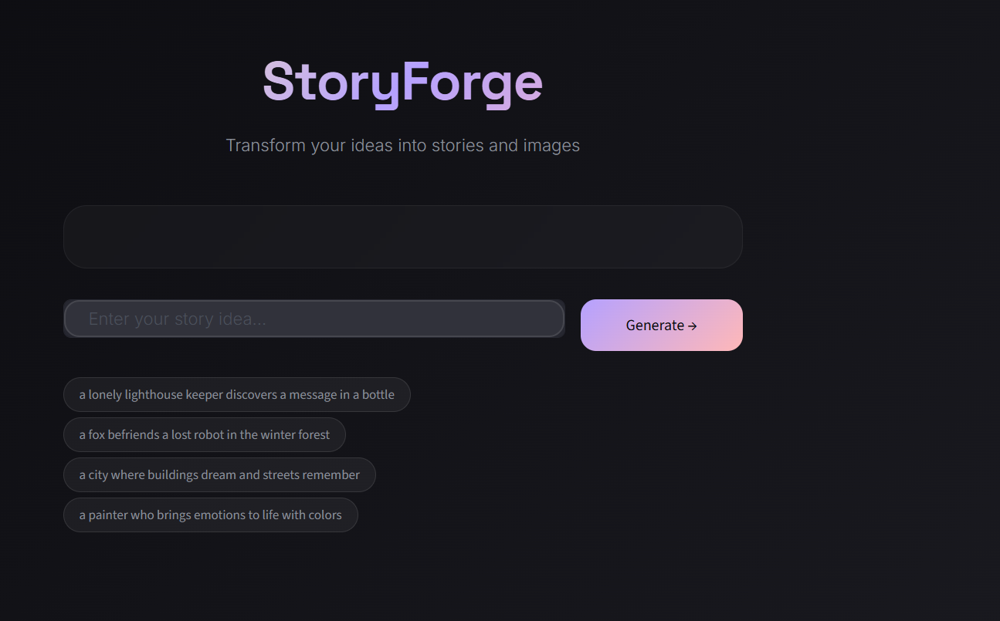
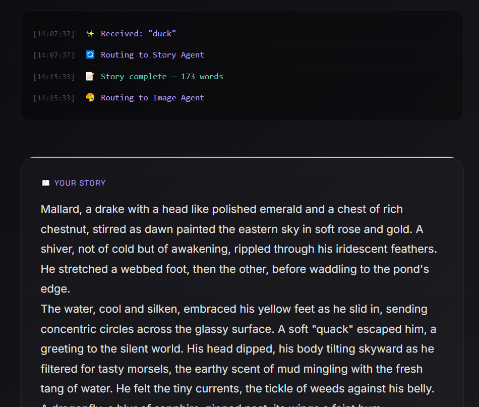
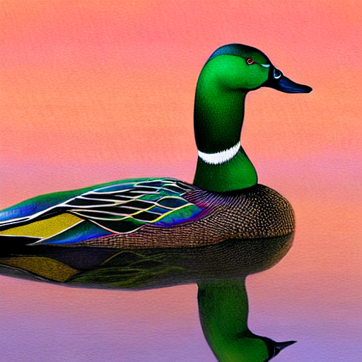

# Multi-Agent Story & Image Generation

**Multi-agent (story + image generation)** 





## What this project does

A **multi-agent AI pipeline** that:

1. Uses several specialized agents working together
2. Generates creative **stories** (narrative text)
3. Creates matching **images** based on the generated story

The agents collaborate — for example:

- Orch agent → Story Writer agent → Critic / Editor agent → Image Prompt Engineer → Image Generator

The result is a coherent short story + one or more generated images.

Built with Python, likely using LangChain / CrewAI / AutoGen style multi-agent framework + LLM API(s) + image generation model (DALL·E, Stable Diffusion, Flux, SD3, etc.).

## 📸 Example Output



*(This image is included in the repository — it shows a typical result of the system)*

##  Quick Start

### 1.Clone the repo

```bash
git clone https://github.com/Manarabdelgawad/Mulit-agents-.git
cd Mulit-agents-
```
### 2.Install dependencies
```bash
python -m venv venv
venv\Scripts\activate       

pip install -r requirements.txt
```

### 3.Set up environment variables
Copy the example file and fill in your API keys:
```bash
cp .env.example .env
```
### 4.Run the application
 Streamlit web interface 
 ```bash
streamlit run streamlit.py
```
## or 
```bash
python main.py
```

### Project Structure
```bash
Mulit-agents-/
├── agents/             
├── config/             
├── utils/             
├── .env.example
├── .gitignore
├── main.py             
├── streamlit.py        
├── graph.py           
├── requirements.txt
├── output.png          
└── README.md
```

### Agents 
Agents
Orchestrator  (agents/Orch.py)
Three nodes — entry, relay, final. Does not call any LLM. Responsibilities:
•	Receives user input and logs the prompt
•	Routes to Story Agent
•	Receives story and routes to Image Agent
•	Logs pipeline completion

Story Agent  (agents/StoryTelling.py)
Calls Groq (Llama 3.1 8B Instant) with a creative writing system prompt. Returns a 150-200 word story with sensory details and a clear arc.
•	llama-3.1-8b-instant via Groq API
•	0.9 (high creativity)

Image Agent  (agents/ImageGen.py)
Runs Stable Diffusion 1.5 locally via the diffusers library. Builds the image prompt directly from the story — no LLM call needed.
•	runwayml/stable-diffusion-v1-5 
•	output.png saved to project root

## APIs 
Groq	Story generation	14,400 req/day	console.groq.com

Stable Diffusion	Image generation	Unlimited (local)	No key needed


